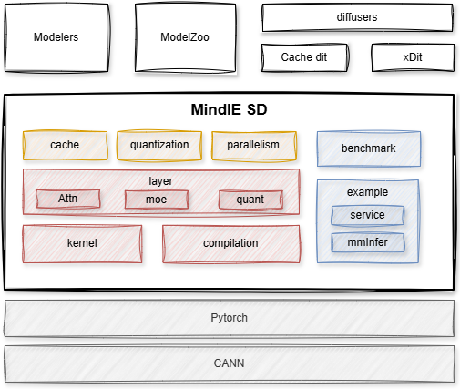

# 架构设计

## 架构目标
MindIE SD旨在构建昇腾亲和的多模态加速系列套件，配合业内模型套件(如：diffusers)，实现多模态推理在昇腾上的效率。主要专注于提供多模态生成的关键算子和融合算子，配合的昇腾亲和量化/稀疏算法，以存代算，多卡并行等策略，实现对diffusers模型的快速迁移和昇腾加速，未来会进一步扩展到多模态理解，全模态等场景的加速。

设计上，各模块间独立解耦设计，可单独使用也可以叠加使用。业内本身存在类似Cache-dit， xDiT等加速手段， 其效果与cache模块和parallelism模块功能相似，存在方案选择的问题，但是MindIE SD中其他组件依旧可以单独与之叠加使用。但各组件都使用了monkey patch

主要特性：
+ 昇腾亲和加速算子：提供昇腾亲和多模态的FA、MM、moe、quant类算子，以及融合算子，支持通过layer模块对外使用。
[**others**](./features/others.md)
+ 量化稀疏能力：针对昇腾的数据类型和算力分布，提供亲和的算法组合，并通过quantization模块导入使用。
[**sparse_quantization**](./features/sparse_quantization.md)
+ 以存代算：提供DiT module、DiT block、attn等多种粒度的cache算法，以支持不同的视图场景加速。
[**cache**](./features/cache.md)、[**graphics_memory_optimization**](./features/graphics_memory_optimization.md)
+ 多卡并行：提供CFG、USP等并行能力，融入加速算子的API中，实现接口替换后的自动使能。
[**parallelism**](./features/parallelism.md)
+ 自动亲和加速：基于torch.compile的inductor机制，自定义融合pass，实现昇腾亲和算子替换。

说明：
1. 基于MindIE SD实现昇腾加速的diffusers模型发布在[Modelers](https://modelers.cn/models?name=MindIE&page=1&size=16)/[ModelZoo](https://www.hiascend.com/software/modelzoo)。
2. 对于相关但非本仓库聚焦的特性，在example中提供了样例以供参考，如：服务化部署样例，多模态推理加速样例。


## 架构介绍
如下图所示，MindIE SD基于pytorch框架对外提供昇腾的加速能力，各加速能力支持独立使用，主要包含cache, parallelism，quantization，layer，kernel等模块。

MindIE SD的相关接口遵从diffusers的接口定义，部分基于MindIE SD实现昇腾加速的diffusers模型在[Modelers](https://modelers.cn/models?name=MindIE&page=1&size=16)/[ModelZoo](https://www.hiascend.com/software/modelzoo)中发布，也支持直接基于diffusers进行简单插件化改造。



基础特性：
+ layer模块：提供基础对外的加速接口(包含attn，moe， quant等特性的layer)，是高阶特性的基础，本身可以单独使用。
+ kernel模块：提供多模态生成相关的昇腾高性能kernel，支持AscendC和triton等编程语言的算子接入。
+ compilation模块：基于fx graph的能力, 开启compile后使能融合pass，实现昇腾自动亲和加速。

高级特性：
+ quantization模块：支持量化能力的自动使能。
+ cache模块：提供以存代算的加速能力的实现。
+ parallelism模块：提供多卡并行的分布式加速能力，需要与layer模块和pytorch协同实现。

## 目录结构
```
- mindiesd
  |- benchmark          // 提供核心kernel的性能看护和compilation的加速效果看护
  |- csrc               // 昇腾kernel代码位置
  |- examples
    |- service          // 服务化样例：将命令行模式改造成服务化方式。
    |- mmInfer          // 多模态视图生成的样例
  |- mindiesd
    |- cache            // 高阶特性：提供cache能力
    |- quantization     // 高阶特性：提供量化能力
    |- parallelism      // 高阶特性：提供自动并行能力
    |- layer            // 提供基础的pytorch的layer接口
    |- compilation      // 提供编译能力，基于fx graph实现自动改图（可依旧保持单算子下发）。
  |- tests              // 测试用例
  ```

## 模型支持列表
-   List of Supported Models
    |模型|功能|Cache|CFG/SP/TP|稀疏FA|量化|数据类型|硬件规格|
    |:---:|:---:|:---:|:---:|:---:|:---:|:---:|:---:|
    |[Stable Diffusion 1.5](https://modelers.cn/models/MindIE/stable_diffusion_v1.5)|文生图|√|√|√|×|FP16|Atlas 800I A2 / 300I DUO|
    |[Stable Diffusion 2.1](https://modelers.cn/models/MindIE/stable_diffusion_2.1)|文生图|√|√|√|×|FP16|Atlas 800I A2 / 300I DUO|
    |[Stable Diffusion XL](https://modelers.cn/models/MindIE/stable-diffusion-xl)|文生图|√|√|√|×|FP16|Atlas 800I A2 / Atlas 800I A3 / 300I DUO|
    |[Stable Diffusion XL_inpainting](https://gitee.com/ascend/ModelZoo-PyTorch/tree/master/MindIE/MindIE-Torch/built-in/foundation/stable_diffusion_xl_inpainting)|SDXL图像重绘|√|×|√|×|FP16|Atlas 800I A2 / Atlas 800I A3|
    |[Stable Diffusion XL_lighting](https://modelers.cn/models/MindIE/SDXL-Lighting)|SDXL轻量化蒸馏模型|√|×|√|×|FP16|Atlas 800I A2 / Atlas 800I A3|
    |[Stable Diffusion XL_controlnet](https://gitee.com/ascend/ModelZoo-PyTorch/tree/master/MindIE/MindIE-Torch/built-in/foundation/stable_diffusion_xl_controlnet)|SDXL引入额外控制条件|√|×|√|×|FP16|Atlas 800I A2 / Atlas 800I A3|
    |[Stable Diffusion XL_prompt_weight](https://gitee.com/ascend/ModelZoo-PyTorch/tree/master/MindIE/MindIE-Torch/built-in/foundation/stable_diffusion_xl_prompt_weight)|SDXL描述增强|√|×|√|×|FP16|Atlas 800I A2 / Atlas 800I A3|
    |[Stable Diffusion 3](https://modelers.cn/models/MindIE/stable_diffusion3)|文生图|√|√|√|×|FP16|Atlas 800I A2 / 300I DUO|
    |[Stable Video Diffusion](https://modelers.cn/models/MindIE/stable-video-diffusion)|图生视频|√|√|√|×|FP16|Atlas 800I A2|
    |[Stable Audio Open v1.0](https://modelers.cn/models/MindIE/stable_audio_open_1.0)|文生语音|√|×|√|×|FP16|Atlas 800I A2 / 300I DUO|
    |[OpenSora v1.2](https://modelers.cn/models/MindIE/opensora_v1_2)|文生视频|√|√|√|×|FP16 / BF16|Atlas 800I A2 / Atlas 800I A3|
    |[OpenSoraPlan v1.2](https://modelers.cn/models/MindIE/open_sora_planv1_2)|文生视频|√|√|√|×|BF16|Atlas 800I A2 / Atlas 800I A3|
    |[OpenSoraPlan v1.3](https://modelers.cn/models/MindIE/open_sora_planv1_3)|文生视频|√|√|√|×|BF16|Atlas 800I A2|
    |[CogView3-Plus-3B](https://modelers.cn/models/MindIE/CogView3-Plus-3B)|文生图|√|√|√|×|BF16|Atlas 800I A2 / Atlas 800I A3|
    |[CogVideoX-2B](https://modelers.cn/models/MindIE/CogVideoX)|文生视频|√|√|√|×|FP16|Atlas 800I A2 / Atlas 800I A3|
    |[CogVideoX-5B](https://modelers.cn/models/MindIE/CogVideoX)|文生视频|√|√|√|×|BF16|Atlas 800I A2 / Atlas 800I A3|
    |[FLUX.1-dev](https://modelers.cn/models/MindIE/FLUX.1-dev)|文生图|√|×|√|×|BF16|Atlas 800I A2 / Atlas 800I A3|
    |[HunyuanDit](https://modelers.cn/models/MindIE/hunyuan_dit)|文生图|√|×|√|×|FP16|Atlas 800I A2 / Atlas 800I A3|
    |[HunyuanVideo](https://modelers.cn/models/MindIE/hunyuan_video)|文生视频|√|√|√|√|BF16|Atlas 800I A2 / Atlas 800I A3|
    |[Wan2.1](https://modelers.cn/models/MindIE/Wan2.1)|文生视频、图生视频|√|√|√|√|BF16|Atlas 800I A2 / Atlas 800I A3|
    |[Wan2.2](https://modelers.cn/models/MindIE/Wan2.2)|文生视频、图生视频|√|√|√|√|BF16|Atlas 800I A2 / Atlas 800I A3|
    